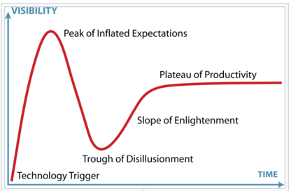

# Hype Cycle

---

The Hype Cycle helps separate reality from fiction.

---

**Hype Cycle**

---

## Points of Interest

The Hype Cycle points of interest are:

### Technology Trigger

A potential technology breakthrough happens.

### Peak of Inflated Expectations  

Early publicity produces a number of success stories and often accompanied by stories of failures. Some companies may take corrective action but most don’t.

### Trough of Disillusionment

Interest wanes as experiments and implementations fail to deliver on the hype.

### Slope of Enlightenment
Technology consumers begin to understand the technology better and how it may benefit them.

### Plateau of Productivity
Mainstream adoption starts to take off. Some technologies making it to the Plateau of Productivity may be doomed to the spiral of death by inattention to details of keeping products alive.

---